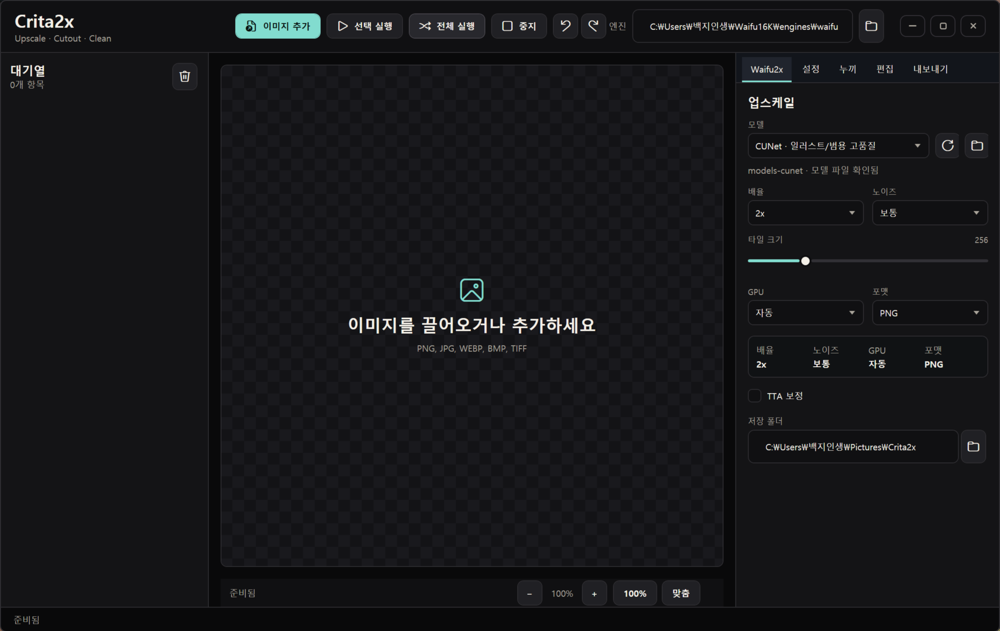

# Crita2x

GPU 업스케일링, 누끼 보정, 빠른 이미지 편집을 한 화면에서 처리하는 Windows 네이티브 이미지 툴입니다.




Crita2x는 [`waifu2x-ncnn-vulkan`](https://github.com/nihui/waifu2x-ncnn-vulkan)을 Windows 데스크톱 앱 안에서 다루기 쉽게 묶은 작업 환경입니다. 이미지를 여러 장 넣고 업스케일한 뒤, 결과물을 바로 확인하면서 누끼 보정, 알파 복원, 회전, 크롭, 리사이즈, 색감 보정까지 이어서 처리할 수 있습니다.

## 주요 기능

| 영역 | 기능 |
| --- | --- |
| 업스케일 | 드래그 앤 드롭 대기열, 선택 실행, 전체 실행, 중지, 배율/노이즈/타일/GPU/TTA/포맷 설정 |
| 모델 | 엔진 폴더의 모델 자동 탐색, CUNet/Anime/Photo 계열 선택, 외부 모델 폴더 지정 |
| 미리보기 | Ctrl+휠 확대/축소, Ctrl+드래그 이동, 맞춤 보기, 100% 보기 |
| 비교 | 기준 이미지 저장, 현재 결과와 분할 비교, 비교 위치 슬라이더 |
| 레이어 | 빈 레이어 추가, 이름 변경, 복제/삭제, 표시 토글, 불투명도 조절, 블렌드 모드, 보이는 레이어 병합 |
| 누끼 | 테두리 기반 배경 제거, 크로마키, 색상 픽커, 페더, 디프린지, 투명 영역 트림 |
| 브러시 | 알파 지우개, 알파 복원, 주변 마스크를 참고하는 자동 복원 브러시 |
| 편집 | 회전, 뒤집기, 크롭, 긴 변 기준 리사이즈, 밝기/대비/채도/샤픈/노이즈 감소, 자동 보정 |
| 기록 | 편집 작업 히스토리 표시, 이전 작업 시점으로 즉시 이동, undo/redo 연동 |
| 내보내기 | PNG, JPEG, TIFF, BMP 저장과 결과 폴더 열기 |

## 실행 요구 사항

- Windows 10 이상
- .NET 8 Desktop Runtime 또는 .NET 8 SDK
- Vulkan 지원 GPU 권장
- Windows용 `waifu2x-ncnn-vulkan`

## 엔진 설치

엔진과 모델 바이너리는 저장소에 포함하지 않습니다. 아래 릴리스를 받은 뒤 압축을 풀어 사용하세요.

- 지정 릴리스: [`waifu2x-ncnn-vulkan 20250915`](https://github.com/nihui/waifu2x-ncnn-vulkan/releases/tag/20250915)

자동 탐지를 쓰려면 다음 위치에 배치하면 됩니다.

```text
engines/
  waifu2x-ncnn-vulkan/
    waifu2x-ncnn-vulkan.exe
    models-cunet/
    models-upconv_7_anime_style_art_rgb/
    models-upconv_7_photo/
```

다른 위치에 둔 경우 앱 상단의 엔진 선택 버튼으로 `waifu2x-ncnn-vulkan.exe`를 직접 지정하면 됩니다. 선택한 실행 파일 옆의 모델 폴더는 자동으로 다시 읽습니다.

## 소스에서 실행

```powershell
git clone https://github.com/sioaeko/Crita2x.git
cd Crita2x
dotnet build
dotnet run --project Waifu16K.csproj
```

`dotnet`이 `PATH`에 없다면 SDK 경로를 직접 호출할 수 있습니다.

```powershell
& 'C:\Program Files\dotnet\dotnet.exe' build
```

## 포터블 빌드

```powershell
dotnet publish -c Release -r win-x64 --self-contained true -p:PublishSingleFile=false -o publish/Crita2x
```

포터블 폴더에서 엔진을 자동으로 찾게 하려면 `engines/waifu2x-ncnn-vulkan` 폴더를 `publish/Crita2x` 안으로 복사하세요.

## 저장소에 포함하지 않는 파일

다음 항목은 용량과 라이선스, 로컬 환경 차이 때문에 Git에 올리지 않습니다.

- `engines/waifu2x-ncnn-vulkan/`
- `downloads/`
- `test-assets/`
- `outputs/`
- `publish/`
- `bin/`, `obj/`
- 작업 인수인계용 로컬 문서 `HANDOFF.md`

## 개발 상태

Crita2x는 현재 활발히 개선 중입니다. 핵심 업스케일 대기열, 모델 탐색, 미리보기 조작, 누끼 도구, 편집 도구는 구현되어 있으며, 패키징과 설치 편의성, 더 세밀한 편집 워크플로는 계속 다듬고 있습니다.

## 라이선스

아직 별도 라이선스 파일을 두지 않았습니다. 외부 배포 전에는 프로젝트 코드 라이선스와 `waifu2x-ncnn-vulkan` 쪽 라이선스를 함께 확인해야 합니다.
